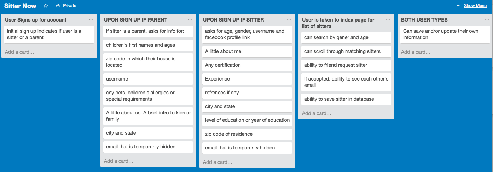
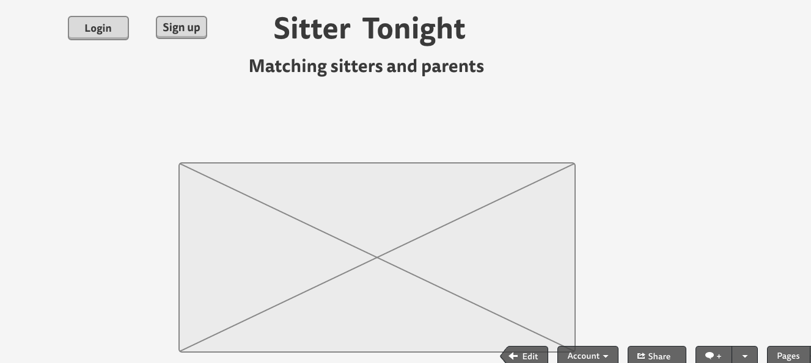
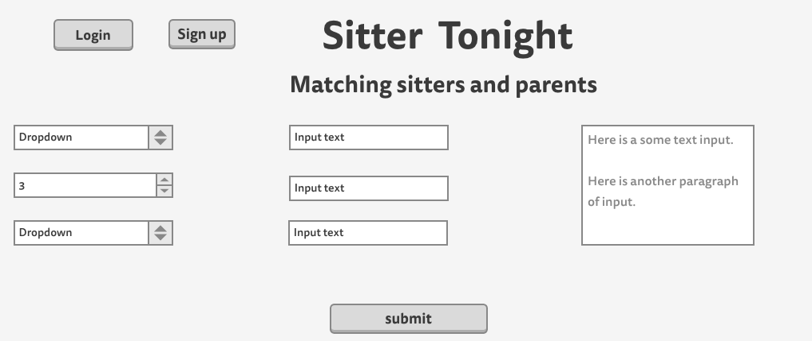
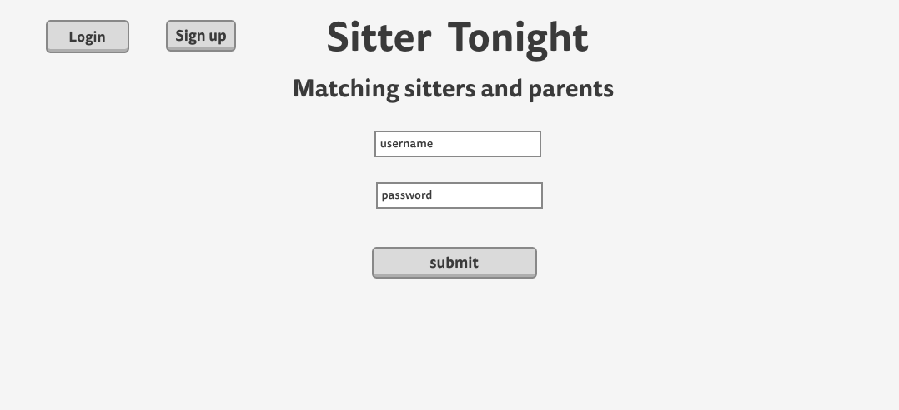
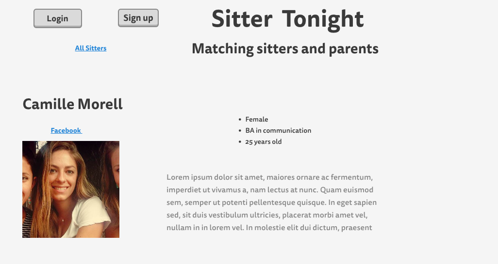
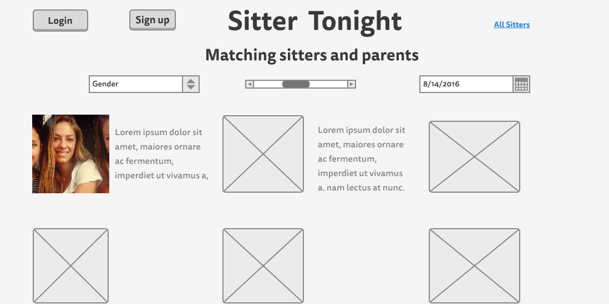

# Sitter Now

Link: https://sitter-now.herokuapp.com/

Sitter Now is an app for parents needing a last minute or steady babysitter. Targeting parents in new cities or in need of a new sitter and babysitters looking for jobs, this app tries to bridge the connection between the two demographics.  Users are able to log into a unique account, access and edit their profile information then navigate to an all-sitters page where they can filter sitter results then email the sitter.

## Technologies Used
  * Express, Node.js
  * React
  * Bootstrap/Font Awesome
  * Auth0
  * mongoDB
  * HTML/CSS 

## Approach Taken
  * The pre-code and first days were primarly used to wireframe, user story and ERD different scales to the site and the beginnings of starting to code.
  * The second day was spent setting up DB connections, Auth0, and setting up the backend of the app and Navigation.
  * The 3rd day was for adding editing features and starting the filter features.
  * The 4th day was for finishing the filter feature, styling with CSS, deploying and trying to add bonus features. 

## Unsolved Problems
  *Well there were quite a few. Ideally, matching would be a feature that would require authentication and in hindsight, setting the user as a sitter or parent would be permanent but with a bit more time I think I could solve a healthy amount of these problems.

## User Stories

## Wire Frames

import React from 'react';
import User from './user';
import InputRange from 'react-input-range';

class UsersContainer extends React.Component {

    constructor(){
      super();
      this.state = {
        values: {
          min: 12,
          max: 92,
        },
        allUsers: [ ],
        filteredUsers: [ ]
      };
    }

   componentWillMount(){
    $.ajax({
      url: '/users',
      method: "GET",
      dataType: "json"
    })
    .done(function(data){
      this.setState({filteredUsers: data});
      console.log(data)
    }.bind(this))
    .fail(function(error){
      console.log(error);
    })
  }

  componentWillReceiveProps(){
    $.ajax({
      url: '/users',
      method: "GET",
      dataType: "json"
    })
    .done(function(data){
      this.setState({filteredUsers: data, allUsers: data });
    }.bind(this))
    .fail(function(error){
      console.log(error);
    })
    $.ajax({
      url: '/profile',
      method: "GET",
      dataType: "json"
    })
  }

  handleValuesChange(component, values) {
    this.setState({
      values: values,
    });

    let filteredUsers = this.state.filteredUsers.filter((val) => {
      return val.age > this.state.values.min && val.age < this.state.values.max
    });

    this.setState({
      filteredUsers: filteredUsers
    });
    if(this.state.values.max-this.state.values.min > 75){
      this.setState({
      filteredUsers: this.props.users
    });
    }

  }

  render(){
      return (
        

        <h2> Age</h2>
        <form className="form">
          

            <InputRange
              maxValue={99}
              minValue={12}
              value={this.state.values}
              onChange={this.handleValuesChange.bind(this)}
            />
          

        </form>
          {
          this.state.filteredUsers.map((userObject, index) =>

              <User object={userObject} key={index} />

          )
          }
        

      )
  }
}

export default UsersContainer;
